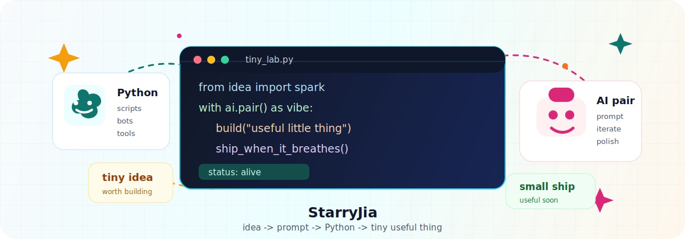
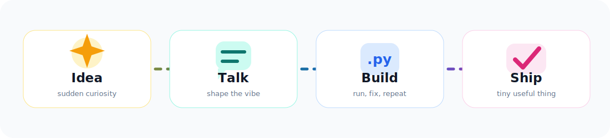

<div align="center">
  

<p>
  <samp>Python-only tinkerer / AI-first maker / vibe coder</samp>
</p>
</div>

---

### Hi, 我是 StarryJia

我喜欢做一些有趣的小玩意：脚本、Bot、自动化、小工具，或者一点带 AI 味道的实验。一个灵感冒出来，先让它跑起来，再慢慢把边角修漂亮。

我喜欢现在这种和 AI 一起写代码的节奏。把需求聊清楚，把直觉翻译成 prompt，把 prompt 变成代码，然后在反馈里继续打磨。对我来说，`vibe coding` 不是随便写写，而是让想法更快进入现实。

> 小玩意也值得被认真对待。

### Current Signal

| Channel | Tuning |
| --- | --- |
| Language | `Python` |
| Mode | AI-assisted, prompt-driven, prototype-friendly |
| Favorite Builds | 小工具、自动化、Bot、奇奇怪怪但有用的实验 |
| Taste | 少一点模板感，多一点个人气味 |
| Rhythm | 先让它活起来，再让它变得可靠 |

### Tiny Workshop

<p align="center">
  
</p>

```text
inbox       : random ideas, daily annoyances, sudden curiosity
process     : talk with AI -> sketch in Python -> run -> polish
output      : tools that save time, make life easier, or simply feel fun
principle   : playful first, practical soon after
```

### Things I Like Building

- 把重复操作变少一点的自动化。
- 能陪我完成某个小任务的 Bot。
- 把 AI 接进日常工作流的小实验。
- 今天想到、今天就能跑起来的 Python 小工具。

### Toolbox

<p>
  <code>Python</code>
  <code>AI-assisted coding</code>
  <code>Prompt engineering</code>
  <code>Automation</code>
  <code>Bots</code>
  <code>CLI tools</code>
  <code>vibe coding</code>
</p>

<details>
<summary><b>GitHub signals</b></summary>

<br>

<p align="center">
  
  
</p>

<p align="center">
  
</p>

</details>

---

<div align="center">
<samp>Stay curious. Build tiny. Let the idea breathe.</samp>
</div>
